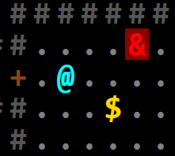

# &lt;rl-display&gt; – a roguelike display custom element

  

This small TS/JS library provides a simple API to draw HTML glyphs in a fashion similar to old-school TTY displays. The main focus is on aesthetic quality of rendering: the whole HTML+CSS rendering pipeline is leveraged, including vector fonts, browser-native animations and transitions and more.

## Links

  - [Interactive manual](https://ondras.github.io/rl-display/manual/)
  - [Demo](https://ondras.github.io/rl-display/demo/)
  - [API Docs](https://ondras.github.io/rl-display/docs/~/RlDisplay.html)
